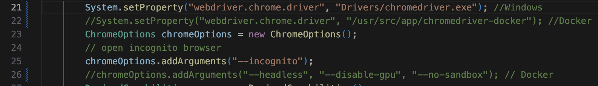

# selenium-archetype

## Tecnologias involucradas

- Selenium
    
    Es un herramienta que ermite la automatización de los navegadores web. Proporciona extensiones para emular la interacción del usuario con navegadores. 

- Gherkin

    El lenguaje Gherkin define la estructura y una sintaxis básica para la descripción de las pruebas que pueden ser entendidas tanto por los integrantes técnicos del equipo como así también por los Analistas/PO o quien quiera que este como representante del cliente. De esta manera mientras se generan pruebas se esta generando documentación viva que describe perfectamente como se comporta el sistema enriqueciendo y manteniendo la documentación.

    El formato fue introducido por la herramienta Cucumber pero también es utilizado por otras herramientas derivadas de Cucumber como Specflow que ya hemos hablado antes en el blog.

 - badeball/cypress-cucumber-preprocessor

    Es un paquete de npm que permite utilizar los archivos ".feature" y la estructura de Gherkin como orquestador de las ejecuciones de Cypress y manejar el output de los resultados en diferentes formatos.

## Requerimientos
#### Descargar Java 8 (1.8.0_350): https://www.java.com/es/download/ie_manual.jsp

    Recuerde que una vez que tenga la lista anterior, vaya a "Estructura del proyecto" y en la "Configuración del proyecto->sección Proyecto": Agregue el SDK de Java 8.

#### Instalar Chrome y su respectivo ChromeDriver: https://googlechromelabs.github.io/chrome-for-testing/

    El Chrome y el ChromeDriver deben ser para Windows con la misma versión.

## Ejecutar con IntelliJ
#### Descargar IntelliJ: https://www.jetbrains.com/es-es/idea/download/?section=windows

    - Marketplace installed in IntelliJ: Cucumber for Java
    - Marketplace installed in IntelliJ: Gherkin
    - Marketplace installed in IntelliJ: XPathView + XSLT
    - Marketplace installed in IntelliJ: JavaFX
    - Marketplace installed in IntelliJ: GitHub

#### Abrir y dar en correr Runner en el Script 
    > src\test\java\runner\Runner.java

## Ejecutar con línea de comando

#### Descargar Maven (3.9.6): https://maven.apache.org/download.cgi

Instalar los paquetes necesarios.

    > mvn clean install

Ejecutar la clase Runner

    > mvn test -Dtest=Runner

### Resultados

Al lanzar el comando anterior podemos ver los resultados de ejecución desde consola:

Seguido de las ejecuciones y sus resultados:

## Run with Docker

Para ejecutar las pruebas que tengamos codificadas desde un contenedor solo es necesario que sigamos los siguientes pasos:

* En el archivo src/test/java/pages/BasePage.java se debe comentar la línea de código 21 y descomentar la línea de comando 22 y 26, esto debido a que en Docker las configuraciones de Chromedriver varian a comparación de Windows.

    

* Construir la imagen del contenedor por medio del dockerfile , para eso hay que abrir una terminal en la raiz de nuetro proyecto (donde se encuentra el Dockerfile).

        $ cd /your/project/path

* Luego de abrir dicha terminal ejecutar el comando 

        $ docker build -t selenium-tests .

* Una vez que la imagen fue generada solo es cuestion de correr una instancia de la imagen para que las pruebas se ejecuten  por medio del comando :

        $ docker run selenium-tests
